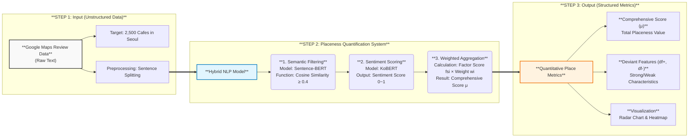

```mermaid
graph LR
    %% 스타일 정의
    style A fill:#f9f9f9,stroke:#333,stroke-width:2px
    style B fill:#e1f5fe,stroke:#0277bd,stroke-width:2px
    style C fill:#fff3e0,stroke:#ef6c00,stroke-width:2px

    %% 1단계: Input
    subgraph Input_Layer ["**STEP 1: Input (Unstructured Data)**"]
        direction TB
        A["**Google Maps Review Data**\n(Raw Text)"]
        A1["Target: 2,500 Cafes in Seoul"]
        A2["Preprocessing: Sentence Splitting"]
        A --> A1
        A --> A2
    end

    %% 2단계: System
    subgraph System_Layer ["**STEP 2: Placeness Quantification System**"]
        direction TB
        B["**Hybrid NLP Model**"]
        
        B1("**1. Semantic Filtering**\nModel: Sentence-BERT\nFunction: Cosine Similarity ≥ 0.4")
        
        B2("**2. Sentiment Scoring**\nModel: KoBERT\nOutput: Sentiment Score 0~1")
        
        B3("**3. Weighted Aggregation**\nCalculation: Factor Score fsi × Weight wi\nResult: Comprehensive Score μ")

        B --> B1
        B1 --> B2
        B2 --> B3
    end

    %% 3단계: Output
    subgraph Output_Layer ["**STEP 3: Output (Structured Metrics)**"]
        direction TB
        C["**Quantitative Place Metrics**"]
        C1["**Comprehensive Score (μ)**\nTotal Placeness Value"]
        C2["**Deviant Features (df+, df-)**\nStrong/Weak Characteristics"]
        C3["**Visualization**\nRadar Chart & Heatmap"]
        
        C --> C1
        C --> C2
        C --> C3
    end

    %% 연결선 (subgraph 간 연결은 노드를 통해)
    A2 ==>|" "| B
    B3 ==>|" "| C
```

